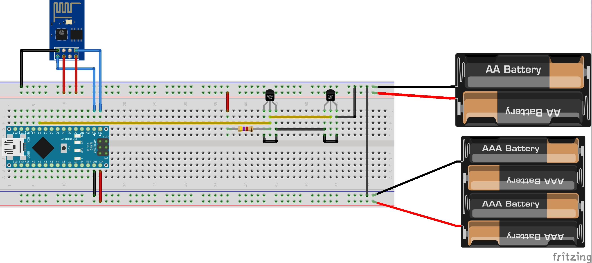

arduino_temperature_logger
==========================

A very reliable temperature logger based on arduino, dallas DS18B20 and a thingspeak server.
In order to work for your setup, you have to change:
AccessPoint SSID, AP password, thingspeak key, addresses of the DS18B20 or any other 1-wire thermometers

Here is my Setup. I tried to draw it as well arranged and understandable as possible. The two battery packs can be of course replaced by any other 3.3V (upper lane) and 5V (lower lane) power source. IMPORTANT!!! The 3.3V power from the arduino IS NOT ENOUGH for the ESP8266!!! Therefore, use an LMS1117V33 to get the 5V (f.e. USB power) to 3.3V.

Please find a list of AT commands at http://www.electrodragon.com/w/Wi07c
